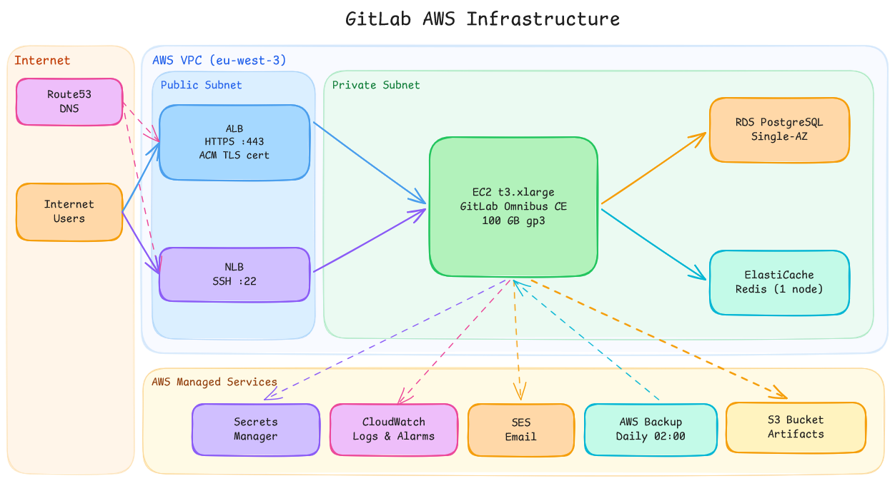

# GitLab Infrastructure on AWS

Terraform deployment of a production GitLab CE instance on AWS. GitLab runs as **Omnibus directly on EC2** using the official GitLab CE AMI — no Docker, no ECS.

## Architecture

Dual load balancer pattern with EC2 as the single compute unit:



| Component | Details |
|---|---|
| EC2 | t3.xlarge (4 vCPU, 16 GB RAM) — GitLab Omnibus, IMDSv2, SSM access |
| EBS | gp3 100 GB encrypted — root volume, daily snapshots via AWS Backup (7-day retention) |
| ALB | HTTP→HTTPS redirect, TLS termination (ACM), health check `/-/readiness` |
| NLB | SSH TCP passthrough port 22 |
| RDS | PostgreSQL 17.2, db.t3.medium, Single-AZ, encrypted, deletion protection enabled |
| ElastiCache | Redis 7.0, cache.t4g.small, 1 node, in-transit + at-rest encryption |
| S3 | Artifacts, uploads, LFS, packages, CI secure files — versioning, AES256, TLS-only policy, lifecycle |
| Secrets Manager | RDS password + Redis token auto-generated; SES SMTP password derived from IAM access key |
| SES | Domain identity, DKIM, mail-from — SMTP via `email-smtp.<region>.amazonaws.com:587` |
| Route53 | `gitlab.<domain>` → ALB, `ssh.gitlab.<domain>` → NLB |
| CloudWatch | Log group (30-day retention) + EC2 Auto Recovery alarm |

For full architecture decisions and component details, see [SPECS.md](SPECS.md).

## Prerequisites

- AWS account with appropriate permissions
- Terraform >= 1.10.0
- Existing VPC with public and private subnets
- Route53 hosted zone

## Deploy

### 1. Configure Variables

Create `terraform/terraform.tfvars`:

```hcl
aws_region          = "eu-west-3"
project_name        = "gitlab"
vpc_id              = "vpc-xxxxxxxx"
public_subnet_ids   = ["subnet-xxxxxxxx", "subnet-yyyyyyyy"]
private_subnet_ids  = ["subnet-xxxxxxxx", "subnet-yyyyyyyy"]
route53_zone_name   = "example.com"
gitlab_version      = "17.9.1"
rds_master_username = "gitlab"
```

Optional overrides (defaults shown):

```hcl
ec2_instance_type = "t3.xlarge"
ebs_volume_size   = 100
```

> `gitlab_domain` (`gitlab.<zone>`) and `smtp_from_address` (`gitlab@<zone>`) are derived automatically from `route53_zone_name`.

### 2. Apply

```bash
cd terraform

terraform init \
  -backend-config="bucket=ct-s3-state-backend" \
  -backend-config="key=gitlab-terraform.tfstate" \
  -backend-config="region=eu-west-3"

terraform plan
terraform apply
```

### 3. First Access

- **Web UI**: `https://gitlab.<domain>`
- **Git SSH**: `ssh.gitlab.<domain>`

```bash
# SSM shell — no SSH key needed
aws ssm start-session --target <instance-id>

# Initial root password — auto-deleted by GitLab after 24h or first login
sudo cat /etc/gitlab/initial_root_password
```

## Runbooks

### Upgrade GitLab version

Change the version in `terraform.tfvars` and apply. The instance is **replaced** with the new AMI.

> **EBS is always recreated** on instance replacement — it is not preserved. S3 data (artifacts, uploads, LFS, packages) persists. Git repository data and `/etc/gitlab/` (including `gitlab-secrets.json`) live on EBS and will be lost.
>
> **Critical:** `gitlab-secrets.json` holds encryption keys for CI variables, 2FA secrets, and tokens. If this file is not restored from an AWS Backup snapshot before running `gitlab-ctl reconfigure` on the new instance, all encrypted database columns become unreadable. Always restore from the latest snapshot in the `gitlab-backup` vault before first reconfigure.

```hcl
gitlab_version = "17.10.0"
```

```bash
terraform apply
```

### Check GitLab health

```bash
sudo gitlab-ctl status
curl -s http://localhost/-/readiness | jq .
```

### View application logs

```bash
# CloudWatch (remote) — log group = /ec2/<project_name>-gitlab, default: /ec2/gitlab-gitlab
aws logs tail /ec2/gitlab-gitlab --region eu-west-3 --follow

# On instance via SSM
sudo gitlab-ctl tail
```

### Connect to the database

```bash
sudo gitlab-rails dbconsole
```

## Troubleshooting

### GitLab not responding after deploy

The first boot runs `gitlab-ctl reconfigure`, which takes 3–5 minutes. Wait and check:

```bash
aws ssm start-session --target <instance-id>
sudo gitlab-ctl status
sudo tail -f /var/log/gitlab/gitlab-rails/production.log
```

### ALB health check failing

The ALB checks `/-/readiness`. GitLab must be fully started and the Rails app healthy. Check:

```bash
curl -v https://gitlab.<domain>/-/readiness
sudo gitlab-ctl status
```

### Instance replaced but data is missing

S3 data (artifacts, uploads, LFS, packages) persists across replacements. Git repository data and GitLab config live on EBS — restore from the latest AWS Backup snapshot in the `gitlab-backup` vault. See the upgrade runbook above for the `gitlab-secrets.json` critical warning.

### SMTP emails not sending

Verify the SES domain is verified and out of sandbox mode in the AWS console. Check GitLab SMTP config:

```bash
sudo gitlab-rails console
Notify.test_email('you@example.com', 'Test', 'Test').deliver_now
```

## Security

- RDS and ElastiCache in private subnets; security groups restrict inter-component traffic
- IMDSv2 enforced on EC2; no SSH port exposed — access via SSM Session Manager only
- All credentials in Secrets Manager (no plaintext passwords in Terraform state)
- S3 access restricted to EC2 instance role; TLS-only enforced via bucket policy
- Storage encrypted at rest: RDS, EBS, ElastiCache (+ in-transit)

## HA Upgrade Path

Variable-only changes — no architectural refactoring required:

| Component | Current | HA upgrade | Impact |
|---|---|---|---|
| RDS | Single-AZ | `multi_az = true` | ~2 min downtime |
| ElastiCache | 1 node | `num_cache_clusters = 2` | Live, no interruption |
| EC2 | Single instance + Auto Recovery | ASG | Planned migration, architecture refactor |

## Related Docs

- [SPECS.md](SPECS.md) — full architecture spec, component config, decisions, and HA cost estimates
- [docs/](docs/) — architecture diagrams
